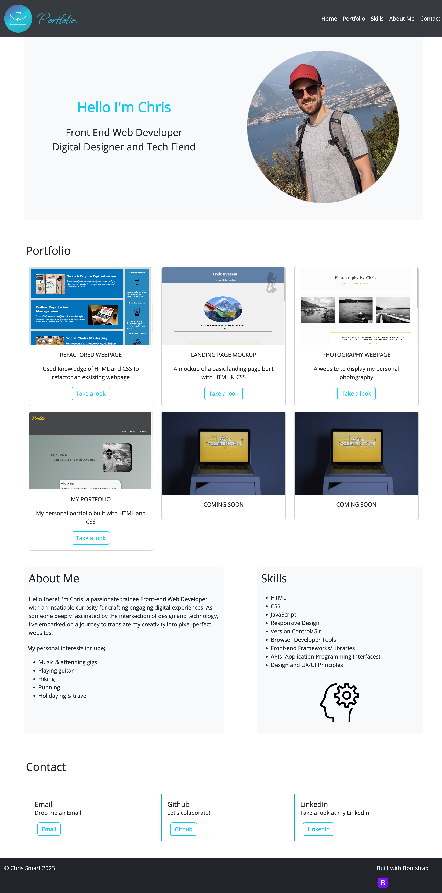

# Bootstrap-Portfolio - Chris Smart

## Description

This website is a personal portfolio where you'll find a collection of my projects and creations showcasing my journey in the world of Web Development.

The purpose of this project was to recreate an exsisting portfolio page utilising the Bootstrap framework.

I have used very little CSS and zero media queries to get a webpage that looks good and is responsive. By using minimal CSS in this project it gave me a far deeper understanding of Bootstraps capabilities and how I could utilise this framework moving forward.

The website features a homepage with a profile image and basic introduction within a hero banner, a skills and about me section, how to contact me section with buttons to Github and LinkedIn and a responsive portfolio grid with external links to some of my deployed projects.

## Link to deployed website

https://chriss-88.github.io/Bootstrap-Portfolio-Chris-Smart/

## Screenshot of deployed website

## License

N/A
